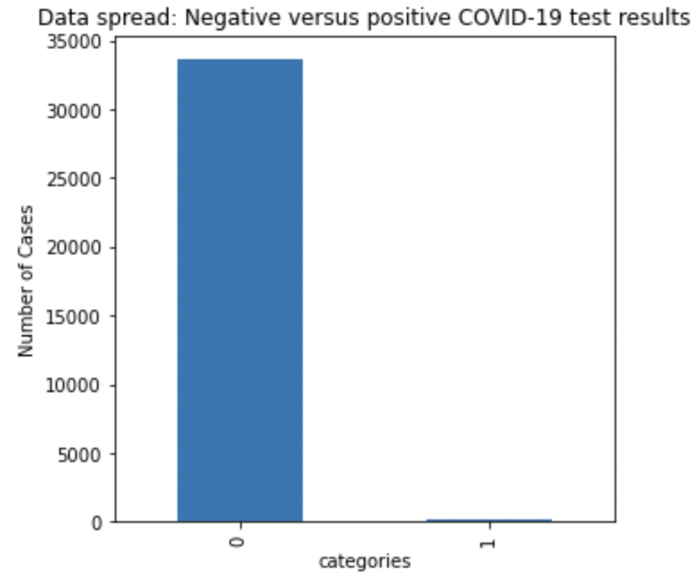
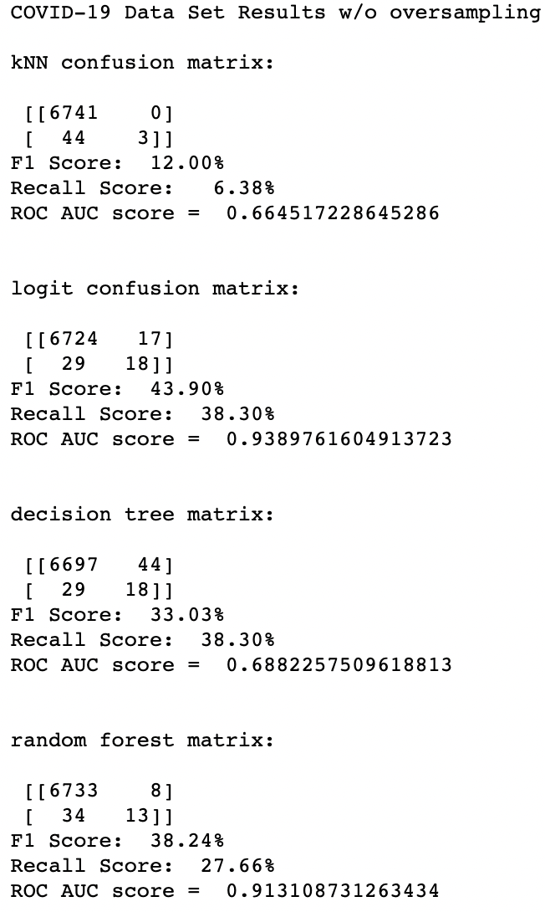
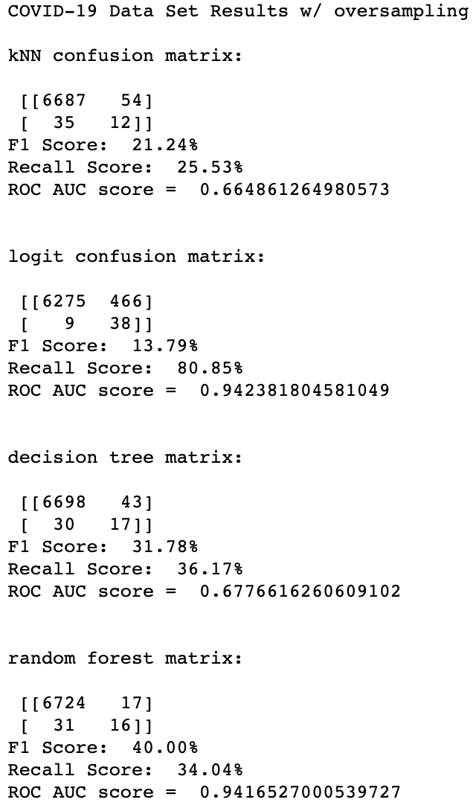
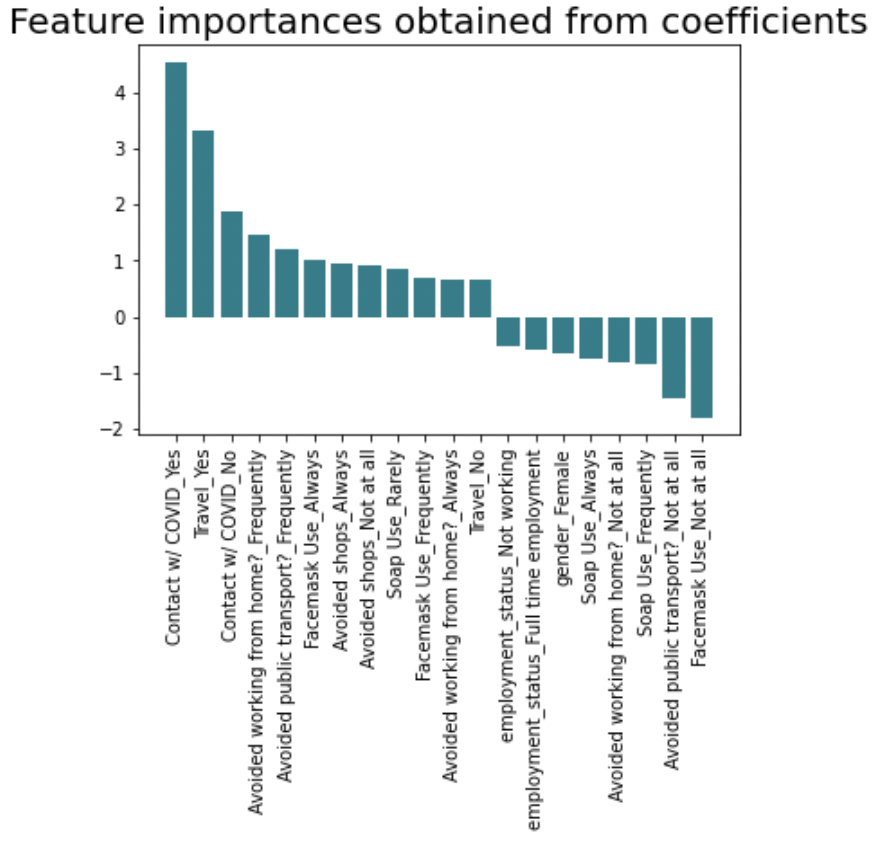

## Classification analysis of COVID-19 data

The goal of this project is to create a model that determines an individual's risk of contacting COVID-19 based on survey data collected by Imperial College of London (ICL). Since the ICL dataset was collected before vaccines were developed, the utility of this model is to determine which factors most drove risk for COVID-19 as a means to better respond to similar pandemics in the future. 

I focused the model on data from the United States from early Feburary through September 2020 (approx 34,000 rows) and initially included 29 rows of both numeric and categorial data that documented underlying health conditions, social conditions, and behaviors before contracting COVID-19. I aggregated some of these categories into overall scores. 

My baseline model consideres the target of "Have you tested positive for COVID-19? - Yes" with the following features:
- Coming into contact with someone who had tested positive for COVID-19 (categorical)
- Travel to area with high COVID-19 prevalence (categorical)
- Facemask use (categorcial)
- Handwashing habits (categorical)
- Use of public transit (categorical)
- Shopping frequency (categorical)
- Gender (categorical)
- Employment Status (categorcial)
- Weight (numeric)
- Age (numeric)
- Household Size (numeric)
- Attending Events Score (numeric score based on categorical responses to attending events)
- Preexisting Condition Score (numeric score based on categorical responses to having health conditions)

I plan to focus on a logistic regression model as it has easier interpretability.

Given that the prevalence of positive COVID-19 cases is low in the dataset (see graphic below), I oversampled the positive cases to have an equal amount of positive and negative cases.

The main metric by which I plan to assess this model is recall because the impact of missing a positive COVID-19 case is higher than misclassifying a negative case as a positive. 

Using an oversampled dataset, I was able to improve the recall of the logistic regression model significantly. 

While the model's results are able to successfully identify more COVID-19 cases than not, the model's interpretability needs improvement. The coefficients do not logically make sense given general understanding of how COVID-19 spreads:

I plan to revisit my data such that the features are more in line with general COVID-19 understanding. 

