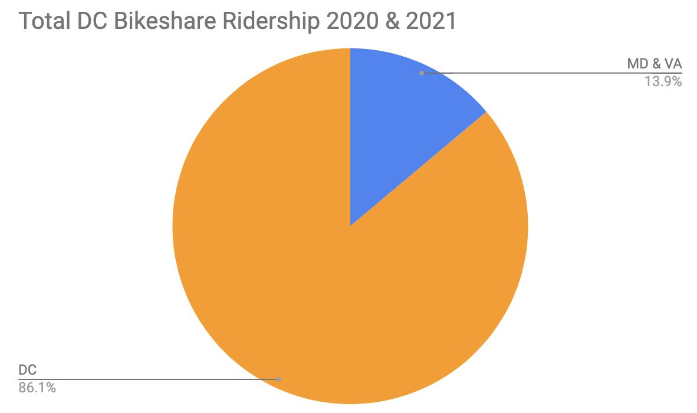
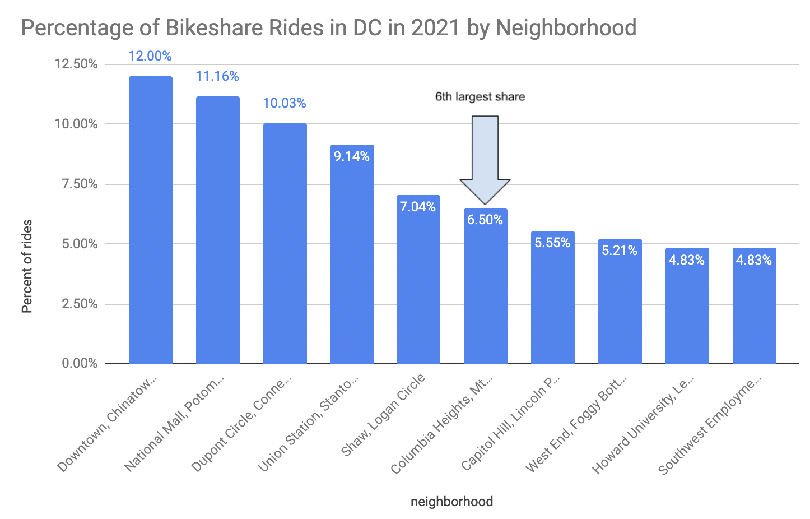

## Captial Bikeshare Bicycle Availability and Customer Retention

The goal of this project is to determine if Captial Bikeshare (DC area bikesharing service) is maintaining service among existing stations as the system expands in 2021. The system has expanded by over 40 stations (mostly in DC suburbs) in 2021; however, anecdotal user experience suggests that fewer bicycles are available in DC's core neighborhoods. The pie chart below shows that the majority of rides occur within DC proper, as compared to rides in the suburbs

This project's primary data source comes from Captial Bikeshare's monthly ridership reports, which include every ride taken in the system (start and stop, times and stations) on a monthly basis. I collected data from 2020 and 2021 to account for seasonal trends (and the impact of the pandemic), as well as to determine when stations are added or removed from the system. I paied this infomation with neighborhood designators by geocode (for DC proper) as well as zip code information for all stations. This helps determine which general areas have changing ridership trends. 

The data does not include infomration on the number of bikes available at a given docking station. This analysis uses the number of rides started as a station as a proxy for this datapoint - as rides can't begin if bikes are not available. We also assume that demand for bikeshare in any given area remains a constant during the analysis period. 

<noscript></noscript><object class='tableauViz'  style='display:none;'><param name='host_url' value='https%3A%2F%2Fpublic.tableau.com%2F' /> <param name='embed_code_version' value='3' /> <param name='site_root' value='' /><param name='name' value='ChangesinCaBiRidershipsummer20-21&#47;Dashboard1' /><param name='tabs' value='no' /><param name='toolbar' value='yes' /><param name='static_image' value='https:&#47;&#47;public.tableau.com&#47;static&#47;images&#47;Ch&#47;ChangesinCaBiRidershipsummer20-21&#47;Dashboard1&#47;1.png' /> <param name='animate_transition' value='yes' /><param name='display_static_image' value='yes' /><param name='display_spinner' value='yes' /><param name='display_overlay' value='yes' /><param name='display_count' value='yes' /><param name='language' value='en-US' /><param name='filter' value='publish=yes' /></object>
                

The map above shows changes in Capital Bikeshare ridership from summer 2020-2021 among stations that had at least 2,000 riders thusfar this year. Generally, ridership has held steady or increased in most areas minus Columbia Heights (center top). This area is densly populated and has many bike commuters. The bar chart below shows that this neighborhood is responsible for nearly 7% of all rides in DC. 

I plan to compare "end ride" data to see how it compares with "start ride" data. Additionally, I would like to add layers to tableau to include population data.
