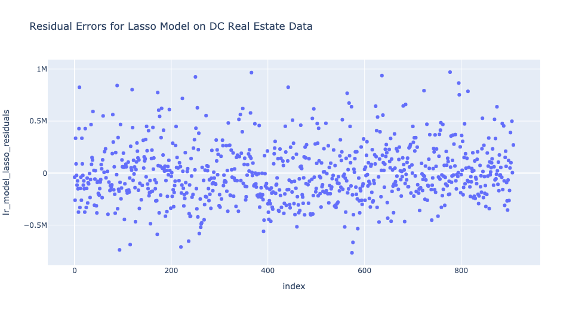
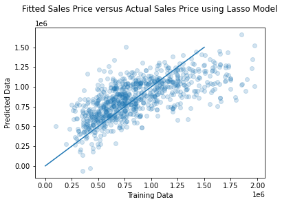

## Analysis of the Washington DC Real Estate market

The goal of this project is to understand which factors most drive real estate sales prices in the DC area and to be able to create a predictive model to determine a given listing's ultimate sale price. To scope the data, this analysis only looks at single family homes and townhomes within 25 mi of downtown DC. 

I scraped data from Compass (a real estate company) to collect 2445 rows of data. This data was reduced to 909 rows once scoped for property type and distance from downtown (using geopy).

In addition to data scraped from Compass, I used a scrape from Washington DC's metro site and geopy to determine each property's distance from a subway station. 

To account for general locations, I grouped property zipcodes according to general geographic areas. 

My baseline model consideres the target of "Final Sale Price" with the following features:
- regions_DC West of River
- Property Age
- Beds
- Baths
- Stories
- Lot_Size
- Has_Garage_Yes
- distance_from_metro

Using a Lasso Regression on the above features, I achieved an R^2 of 0.4534 and an MAE of $212,193. The figures below show the residual error for each listing (first) and a plot of predicted versus actual listings. 

The project goal is to be able to produce a predictive model that can estimate a given property's ultimate selling price. Given the MAE of this model, I need to further feature engineer to reduce the MAE to an acceptable level. 

