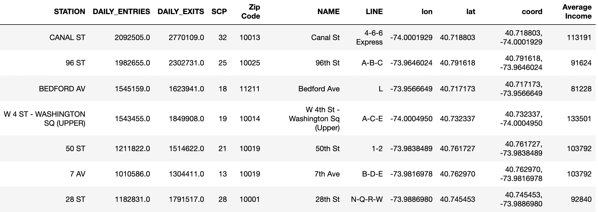
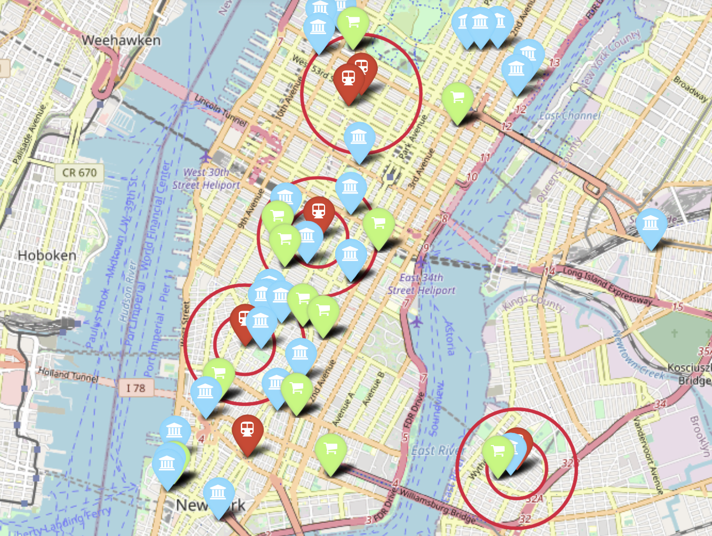

## Analysis of NYC Subway Data

This project aims to provide WomenTechWomenYes (WTWY) with a list of subway stations that the organization can target with their street teams to collect email addresses. 

In order to make the list of subway stations the most actionable for the client, my methodology includes the following factors:

1) Subway station size as indicated by turnstile -> WTWY teams need to personally interact with commuters and a large station may not provide the best enviornment for one on one interaction. This analysis looks at medium sized stations, as defined by having between 12-32 turnstiles (SCP in the dataframe). 
2) Subway station foot traffic on a per-day basis -> This analysis aims to provide WTWY street teams with stations that are consistently busy. This analysis considers both entries and exits, and scoped the 'busiest' stations as the 50 highest entries and exits. 
3) Subway stations located in higher income zip codes & proximity to higher quality grocery stores -> This provides street teams with an opportunity to reach individuals that may donate to WTWY. The analysis used average incomes according to 2019 census data at a zipcode level as well as Google Maps geocoords.
4) Subway stations located near universities -> This provides street teams with an opportunity to reach individuals that are interested in tech. Geocoords from NYC Open Data informed this segment of the methodology

The subway stations that met criteria 1-3 appear in the dataframe below:

The map below used GEOPY and FOLIUM to highlight which subway stations (red icon) meet criteria 3 & 4. The blue icons represent universities while the green icons represent stores. The red circles around the red icons represent 1/4 mile radiuses, showing proximity to universities and stores. 

Note - FOLIUM provides an interactive HTML map, I am trying to figure out how to render it in markdown. 

Based on this analysis, WTWY should place their street teams at the following suggested stations:

1) W 4 ST - WASHINGTON SQ
2) 28 ST
3) BEDFORD AV

